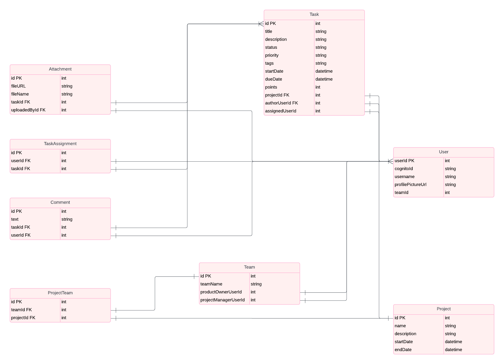

# Build a Complete Project Management Dashboard

This repository hosts the code for a comprehensive tutorial on building a Project Management Dashboard using Next.js, Node.js, and AWS services.

## Join Our Community

## Model Diagram Project



## Technology Stack

- **Frontend**: Next.js, Tailwind CSS, Redux Toolkit, Redux Toolkit Query, Material UI Data Grid
- **Backend**: Node.js with Express, Prisma (PostgreSQL ORM)
- **Database**: PostgreSQL, managed with PgAdmin
- **Cloud**: AWS EC2, AWS RDS, AWS API Gateway, AWS Amplify, AWS S3, AWS Lambda, AWS Cognito

## Getting Started

### Prerequisites

Ensure you have these tools installed:

- Git
- Node.js
- npm (Node Package Manager)
- PostgreSQL ([download](https://www.postgresql.org/download/))
- PgAdmin ([download](https://www.pgadmin.org/download/))

### Installation Steps

1. Clone the repository:
   `git clone [git url]`
   `cd project-management`

2. Install dependencies in both client and server:
   `cd client`
   `npm i`
   `cd ..`
   `cd server`
   `npm i`

3. Set up the database:
   `npx prisma generate`
   `npx prisma migrate dev --name init`
   `npm run seed`

4. Configure environment variables:

- `.env` for server settings (PORT, DATABASE_URL)
- `.env.local` for client settings (NEXT_PUBLIC_API_BASE_URL)

5. Run the project
   `npm run dev`

## Additional Resources

### Database Management Commands

- Command for resetting ID in database:
  ```sql
  SELECT setval(pg_get_serial_sequence('"[DATA_MODEL_NAME_HERE]"', 'id'), coalesce(max(id)+1, 1), false) FROM "[DATA_MODEL_NAME_HERE]";
  ```


## Links Backend:
- Node - https://nodejs.org/en 
- Vscode Studio - https://code.visualstudio.com/ 
- Express - https://expressjs.com/ 
- Postgres download - https://www.postgresql.org/download/ 
- PgAdmin download - https://www.pgadmin.org/download/ 
- Prisma docs - https://www.prisma.io/docs/getting-started/quickstart-sqlite
- Postman download - https://www.postman.com/downloads/  

## Links AWS: 
- AWS - https://aws.amazon.com/
- AWS cli - https://docs.aws.amazon.com/cli/latest/userguide/cli-chap-welcome.html
- AWS cognito - https://aws.amazon.com/cognito/ 
- AWS cognito related links - 
- https://ui.docs.amplify.aws/react/connected-components/authenticator
- https://docs.amplify.aws/gen1/javascript/tools/libraries/configure-categories/

## Links Frontend:
- Nextjs - https://nextjs.org/docs/app/getting-started/installation
- Redux Toolkit w/ Nextjs - https://redux-toolkit.js.org/usage/nextjs
- Redux Toolkit Query - https://redux-toolkit.js.org/rtk-query/overview
- React DnD - https://react-dnd.github.io/react-dnd/docs/overview
- Nextjs Providers - https://nextjs.org/docs/app/building-your-application/rendering/composition-patterns#using-context-providers
- Tailwind - https://tailwindcss.com/docs/configuration
- Tailwind Linting - https://tailwindcss.com/blog/automatic-class-sorting-with-prettier
- Tailwind Prettier - https://github.com/tailwindlabs/prettier-plugin-tailwindcss
- Recharts - https://recharts.org/en-US/api 
- MUI - https://mui.com/x/react-data-grid/ 
- Gantt Charts - https://github.com/MaTeMaTuK/gantt-task-react